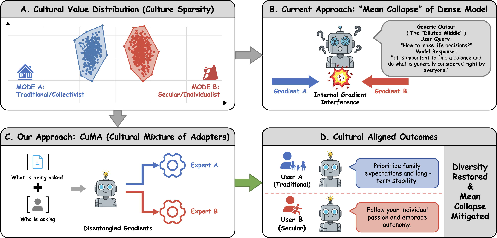
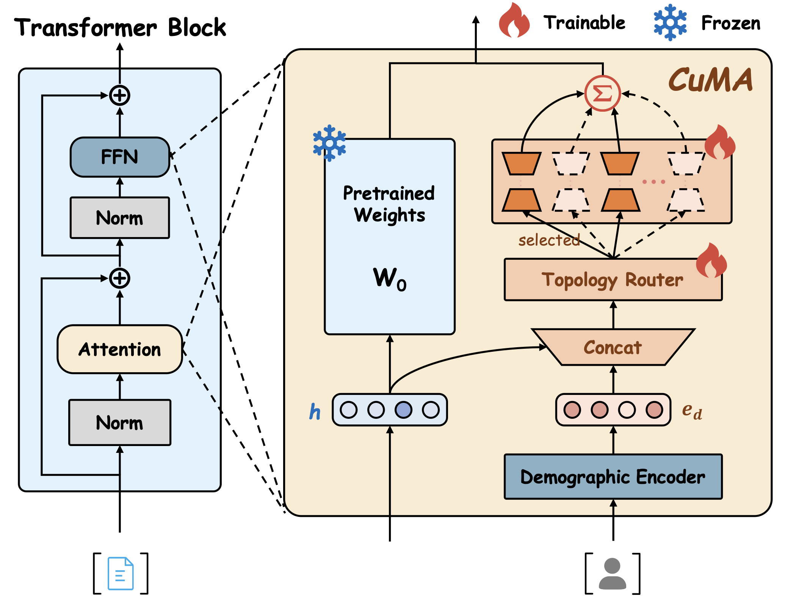

# CuMA: Aligning LLMs with Sparse Cultural Values via Demographic-Aware Mixture of Adapters

<p align="center">
  <!-- <a href="https://2026.aclweb.org/"></a> -->
  <a href="https://arxiv.org/abs/2601.04885"></a>
  <a href="LICENSE"></a>
</p>

<!-- > **Status.** CuMA has been accepted to the ACL 2026 Main Conference. The ACL Anthology/proceedings page is not available yet. The current public preprint is [arXiv v1](https://arxiv.org/html/2601.04885v1); an updated v2 will follow. -->

<p align="center">
  
</p>

Standard dense alignment methods force LLMs to collapse conflicting cultural values into a generic average (**Mean Collapse**), producing responses that fail to resonate with any specific group. We attribute this to **Cultural Sparsity** — human values cluster into distinct, conflicting modes that a single set of parameters cannot simultaneously capture.

CuMA resolves this via **demographic-aware routing**: it conditions expert selection on both semantic content and the user's demographic profile, learning a *Latent Cultural Topology* that explicitly disentangles conflicting gradients into specialized parameter subspaces. The figure below shows the architecture of a CuMA transformer block. CuMA freezes the backbone weights and injects $N$ LoRA experts, using a demographic-conditioned router to select the Top-$k$ experts per token.

<p align="center">
  
</p>

## Highlights

- **Mean collapse mitigation:** dense baselines show high prediction entropy and lower response diversity, while CuMA sharpens per-profile alignment and preserves cross-profile diversity.
- **Routing precision beats scale:** CuMA ($r=8$, 1.53% trainable parameters) outperforms larger semantic-only MoE baselines such as HydraLoRA (2.31%).
- **Distributional fidelity:** CuMA improves WVB accuracy while reducing EMD, indicating that it models the full shape of human value distributions rather than only predicting the majority mode.
- **Holistic alignment:** on Qwen3-8B, CuMA reaches 78.2% / 76.8% GRPO win-rates on CA / PRISM generation tasks.
- **Zero-shot transfer:** the learned latent topology supports held-out demographic profile generalization, with sample-weighted zero-shot WVB accuracy of 48.10%, outperforming the strongest baseline at 36.2%.

<!-- ## Results Snapshot

| Method | Params | WVB Acc | WVB EMD ↓ | CA Acc | CA-WR | PRISM-WR |
|---|---:|---:|---:|---:|---:|---:|
| Full Fine-Tuning | 100% | 45.54 | 0.2228 | 49.50 | 68.5 | 65.2 |
| LoRA | 0.37% | 40.06 | 0.2700 | 38.53 | 65.5 | 62.2 |
| HydraLoRA | 2.31% | 45.36 | 0.2793 | 52.80 | 73.6 | 70.4 |
| CuMA ($r=8$) | 1.53% | 49.02 | 0.1980 | 55.40 | 76.5 | 75.5 |
| **CuMA ($r=64$)** | 4.15% | **50.64** | **0.1876** | **57.20** | **78.2** | **76.8** |

Results above are from Qwen3-8B. CA-WR and PRISM-WR denote GRPO win-rate (%) against the base model. -->

## Requirements

The project uses `pyproject.toml` for dependency management. We recommend using [uv](https://github.com/astral-sh/uv) for fast installation:

```bash
uv sync
```

## Project Structure

```
models/          # CuMA model, demographic encoder, and baseline models (HydraLoRA, MixLoRA)
train/           # Training scripts for CuMA (SFT/DPO/GRPO) and all baselines
evaluate/        # Evaluation (Acc, F1, EMD, Win-Rate)
utils/           # Dataset loaders and utilities
process_datasets/# Data preprocessing
scripts/         # Shell scripts for training, evaluation, and ablation studies
```

## Running Experiments

### 0. Dataset Preparation

- **WorldValuesBench (WVB)**: Download from [WorldValuesBench](https://github.com/Demon702/WorldValuesBench) and place contents in `WorldValuesBench/`.
- **PRISM & Community Alignment (CA)**: Run the download script:
  ```bash
  python download_datasets.py
  ```

### 1. Preprocessing

```bash
python process_datasets/process_datasets.py
```

### 2. Training

**CuMA on WVB (SFT):**
```bash
bash scripts/train_cuma_wvs_sft.sh
```

**CuMA on CA (SFT → RL):**
```bash
bash scripts/train_cuma_facebook_sft_dpo.sh   # SFT → DPO
```

**CuMA on PRISM (SFT → RL):**
```bash
bash scripts/train_cuma_prism_sft_dpo.sh      # SFT → DPO
```

**Baselines (examples):**
```bash
bash scripts/train_lora_wvs_sft.sh          # LoRA
bash scripts/train_fft_wvs_sft.sh           # Full Fine-Tuning
bash scripts/train_hydralora_wvs_sft.sh     # HydraLoRA
bash scripts/train_mixlora_wvs_sft.sh       # MixLoRA
bash scripts/train_prefix_wvs_sft.sh        # P-Tuning v2
```

**Llama-3.1-8B:**
```bash
bash scripts/train_cuma_wvs_sft_llama3.1_r64_lr5e-6.sh
```

**Ablation studies:**
```bash
bash scripts/train_cuma_wvs_sft_r64_a128_lr5e6_ablation_minimal.sh     # w/o Demo & Balance
bash scripts/train_cuma_wvs_sft_r64_a128_lr5e6_ablation_soft_routing.sh # Soft routing
bash scripts/train_cuma_wvs_sft_wo_demo.sh                              # w/o Demographic
```

### 3. Evaluation

```bash
bash scripts/evaluate_wvs.sh         # WVB: Acc / Macro-F1 / EMD
bash scripts/evaluate_dpo.sh         # CA/PRISM: GPT-4o Win-Rate
```

GRPO training is also supported via `train/train_cuma_grpo.py` with GPT-4o as the demographic-aware reward judge.

## Citation

If you find this work useful, please cite:

```bibtex
@misc{sun2026cuma,
    title={CuMA: Aligning LLMs with Sparse Cultural Values via Demographic-Aware Mixture of Adapters},
    author={Ao Sun and Xiaoyu Wang and Zhe Tan and Yu Li and Jiachen Zhu and Yuheng Jia and Shu Su},
    year={2026},
    eprint={2601.04885},
    archivePrefix={arXiv},
    primaryClass={cs.CL},
    url={https://arxiv.org/abs/2601.04885},
}
```

## License

This project is licensed under the [Apache License 2.0](LICENSE).
